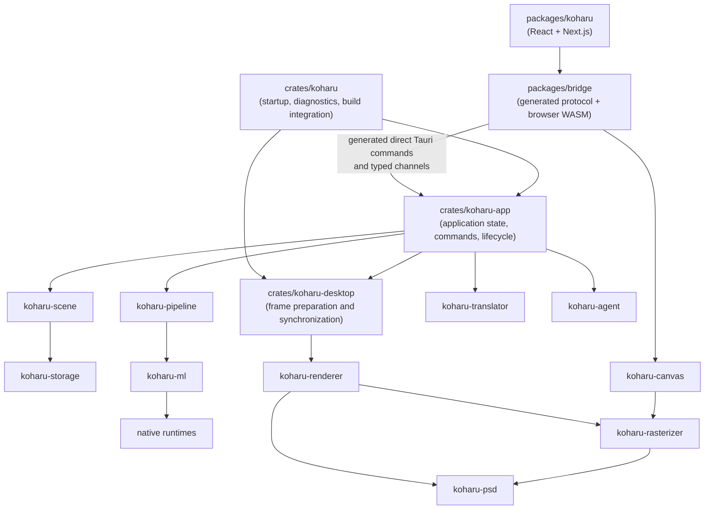

# Architecture

Koharu is one desktop application, not a web client attached to a separate server.

## Frontend

`packages/koharu` owns product presentation and interaction state: project browser, page rail, canvas controls, inspector, settings, resource activity, and Agent panel. `packages/ui` owns reusable React primitives and styling. `packages/bridge` owns the generated Tauri protocol, browser canvas adapter, and derived `koharu-canvas` WASM package.

The frontend invokes named Tauri commands directly. It does not maintain an HTTP client or decode a generic application event envelope.

## Application

`crates/koharu` owns process startup, diagnostics, Tauri configuration, and build integration. It composes `koharu-app` with `koharu-desktop`. `koharu-app` owns Tauri-managed state, project lifecycle, command serialization, processing jobs, desktop synchronization, and agent hosting. Independent typed channels publish project, canvas, job, download, preference, and resource updates.

Rust signatures generate `packages/bridge/src/protocol.ts`; that file is derived output.

## Domain and durability

`koharu-scene` is the canonical typed in-memory project. It owns page hierarchy, semantic components, relations, patches, revisions, and session undo. `koharu-storage` owns opaque complete state payloads and immutable blob bytes on disk.

## Processing and translation

`koharu-pipeline` owns the fixed page workflow, model lifetime, scheduling, progress, stop semantics, and incremental stage commits. `koharu-ml` owns model implementations and the shared device abstraction. `koharu-translator` owns local and hosted translation connectivity.

## Rendering and presentation

`koharu-renderer` interprets a scene page into a portable prepared frame owned by `koharu-rasterizer`. Browser transport separates a lightweight frame manifest from independently addressable, content-hashed resources. Raster images are canonical GPU-safe tiles with sampling gutters, allowing the browser to copy, validate, upload, cache, and evict bounded pieces instead of a page-sized RGBA texture. `koharu-canvas` retains those resources across page changes, stages each manifest, and atomically activates it through WebGPU only after every required resource is ready. Native PNG, PSD, font previews, and agent previews compose the same tiles into the complete full-resolution frame through the rasterizer's native readback path. `koharu-desktop` coordinates latest-wins preparation, publishes frame generations, and serves exact-generation manifest/resources; it no longer owns a native window compositor.

## Native bindings

Safe Rust wrappers (`koharu-torch`, `koharu-llama`, and `koharu-diffusion`) are separated from their unsafe `-sys` dynamic-loading crates. `koharu-runtime` discovers, downloads, validates, and loads native packages.
