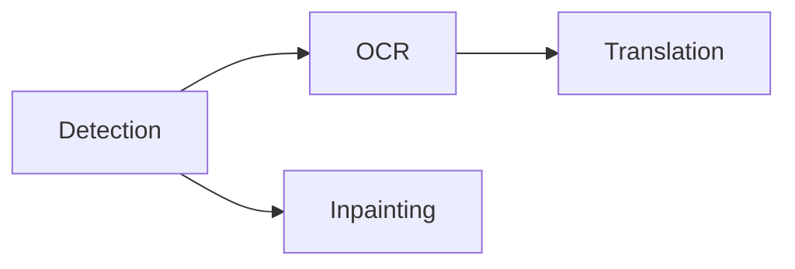

# Pipeline, Rendering, and Browser Presentation

## Fixed pipeline

`koharu-pipeline` coordinates a small named workflow rather than a runtime graph:

An execution unit is one stage on one page. Pages enter in project order, but a completed detection immediately makes that page's dependent branches eligible. There is no global “finish detection everywhere first” barrier.

Each stage produces a semantic scene patch. The application commits it immediately, synchronizes the current canvas, and groups all revisions from one invocation into one undo step.

## Scheduling and residency

Accelerator inference uses one admission lane because representative heterogeneous overlap reduced throughput through compute and memory-bandwidth contention. CPU-only execution can retain independent per-model lanes.

Models load lazily and remain available for reuse. The residency manager observes resident and peak workspace memory, keeps a safety margin, evicts idle models in least-recently-used order when needed, and retries one learned out-of-memory case after cleanup.

Stopping is cooperative. No new stage starts after the stop request; an active native call returns safely, and its result is discarded if it has not committed.

## Retained rendering

`koharu-renderer::Renderer` turns a scene snapshot and page ID into one immutable native `Frame`. The frame contains ordered retained layers, entity lookup, presentation metadata, dependencies, diagnostics, and vector scenes. It prepares that state as a portable `koharu-rasterizer` frame bundle for browser presentation and native readback.

Scene translation is the only visible text source. Typography, fit relations, fonts, images, visibility, and opacity all come from scene data. The renderer loads resources and retains reusable nodes; callers do not provide an alternate document model.

The WebGPU canvas, flattened PNG, layer crops, and PSD adapter consume this same prepared frame. Incremental renderer updates reuse unchanged nodes but must produce the same result as a complete render.

## Browser presentation

The Tauri CEF webview owns the complete visible surface. React draws interface chrome, menus, controls, and inspectors, while `koharu-canvas` compiles to WASM and presents the prepared page through WebGPU in an `HTMLCanvasElement`. Transient camera, transform, stroke, and sampling work remains in the browser; only completed edits cross the Tauri command boundary.

Page changes publish a generation before the browser requests its lightweight manifest. The canvas reports only missing content IDs, receives those resource packets in separate asynchronous steps, and keeps the previous page visible until the staged generation can activate atomically. Raster resources are canonical 1024-pixel logical tiles with one-pixel interior sampling gutters; this bounds every WASM copy and WebGPU texture while preserving filtered edges. CPU and GPU resources use coordinated bounded caches, so returning to a recently displayed page does not resend or re-upload unchanged tiles. Obsolete native preparations and browser requests cannot publish or activate over a newer generation.

Validate visual changes through the final Tauri window because WebGPU adapter availability, device loss, sizing, and display scaling depend on the system webview. Native PNG and PSD checks still verify the shared rasterizer's readback path independently.

In debug builds, the CEF remote debugging endpoint is `http://127.0.0.1:4000`; use semantic CDP inspection for the DOM and canvas lifecycle, and native window capture when the final pixels matter.
