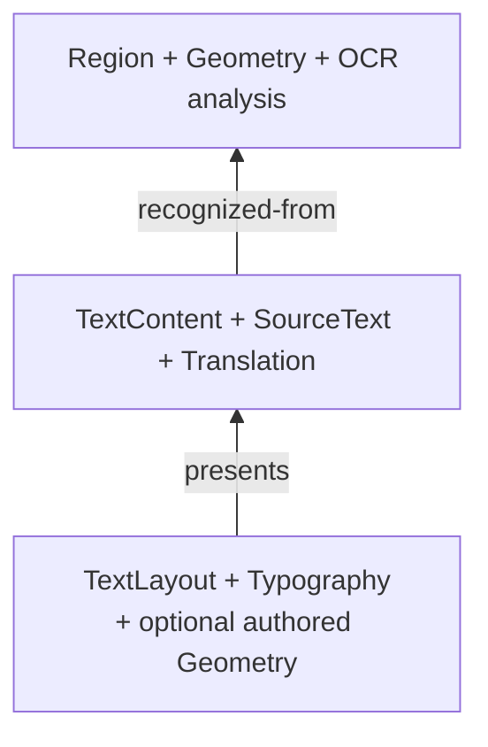

# Scene and Storage

The scene and storage crates deliberately own different kinds of truth.

## Scene meaning

`koharu-scene` owns the canonical in-memory document. Each project contains ordered pages; each page has a local arena of stable external entity IDs, hierarchy, typed components, and typed relations.

Text analysis, semantic content, and presentation are distinct:

Detection geometry therefore remains source analysis instead of becoming a movable visible layer. Translation can change without losing OCR provenance, and presentation can change without rewriting semantic text.

## Snapshots and patches

Snapshots are immutable and cheap to clone. An edit creates a patch bound to a project and base revision. Every operation records preconditions and an inverse for session undo.

A stale patch is never silently accepted. Independent derived work must explicitly rebase onto a newer snapshot, and the rebase fails when an observed input or overlapping write changed.

## Storage format

`koharu-storage` is domain-agnostic. It persists:

- one opaque complete scene payload in alternating `state-a.khr` and `state-b.khr` slots;
- content-addressed immutable blob files;
- checksums and the referenced blob set required to validate a state.

Saving publishes missing blobs first, builds the inactive state slot beside its destination, flushes it, and atomically makes it durable. The previously valid slot remains available if publication fails.

## Recovery and collection

Opening chooses the newest valid state. A corrupt newer slot can fall back to the other valid slot. Blob reads may use read-only memory mapping without exposing that storage detail to scene consumers.

Garbage collection is explicit. It retains blobs referenced by both valid disk states and live scene scopes, including session undo history.

## Application boundary

The application stores each project as a `.khrproj` directory and owns project naming, active-page selection, undo grouping, and UI projection. Renderer, pipeline, and Agent consume snapshots and submit semantic patches; they do not write storage files directly.
