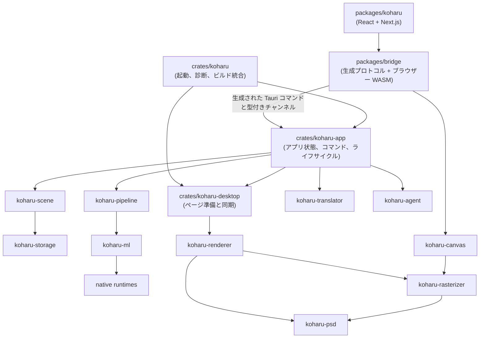

# アーキテクチャ

Koharu は別サーバーへ接続する Web クライアントではなく、1 つのデスクトップアプリです。

## フロントエンドとアプリ

`packages/koharu` はプロジェクトブラウザー、ページレール、キャンバス操作、インスペクター、設定、アクティビティ、Agent パネルを所有します。`packages/ui` は再利用可能な React 部品とスタイルを所有します。`packages/bridge` は生成された Tauri プロトコル、ブラウザーキャンバスアダプター、派生した `koharu-canvas` WASM パッケージを所有します。

フロントエンドは名前付き Tauri コマンドを直接呼び出し、HTTP クライアントや汎用イベント封筒を持ちません。

`crates/koharu` はプロセス起動、診断、Tauri 設定、ビルド統合を所有し、`koharu-app` と `koharu-desktop` を構成します。`koharu-app` は Tauri 状態、プロジェクトライフサイクル、コマンド直列化、処理ジョブ、デスクトップ同期、Agent ホストを所有します。独立した型付きチャンネルが各更新を配信します。Rust 署名から `protocol.ts` を生成します。

## ドメイン、処理、描画

`koharu-scene` はページ階層、意味コンポーネント、関係、パッチ、リビジョン、セッション undo を持つ正規プロジェクトです。`koharu-storage` は不透明な状態ペイロードと blob を永続化します。

`koharu-pipeline` は固定ワークフロー、モデル寿命、スケジューリング、進捗、停止、段階コミットを所有します。`koharu-ml` はモデルと共有デバイス、`koharu-translator` はローカル・ホスト翻訳接続を所有します。

`koharu-renderer` はシーンページを `koharu-rasterizer` が所有する移植可能な準備済みフレームへ変換します。`koharu-canvas` はそのフレームを WASM でコンパイルし、Tauri WebView 内の WebGPU キャンバスへ表示します。PNG/PSD とネイティブプレビューは、同じフレームをラスタライザーのネイティブ読み戻し経路で利用します。`koharu-desktop` はページ準備とフレーム世代を調整し、ネイティブウィンドウ合成は所有しません。

安全な Rust ラッパーは unsafe な `-sys` 動的ロードクレートと分離されています。
