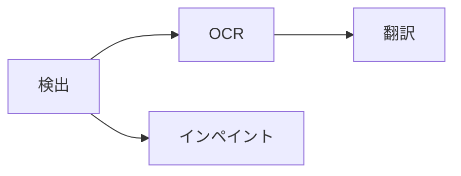

# パイプライン、レンダリング、デスクトップ合成

## 固定パイプライン

`koharu-pipeline` は実行時グラフではなく、小さな名前付きワークフローを調整します。

実行単位は 1 ページの 1 ステージです。ページはプロジェクト順に入りますが、検出完了直後にそのページの後続分岐を実行可能にし、全ページの検出完了を待ちません。

各ステージは意味シーンパッチを作り、アプリが即時コミットして現在キャンバスを同期します。1 回の呼び出しの全リビジョンは 1 つの undo 操作になります。

## スケジューリングと常駐

代表的な異種モデル同時実行は計算・メモリ帯域競合でスループットが低下したため、アクセラレーター推論は 1 つの受付レーンを使います。CPU 専用実行はモデル別レーンを持てます。

モデルは遅延ロードされ、再利用のために常駐します。常駐マネージャーは常駐量とピーク作業メモリを観測し、安全余裕を残し、必要なら LRU 順でアイドルモデルを解放します。学習した OOM はクリーンアップ後に 1 回再試行します。

停止は協調的です。新しいステージを開始せず、実行中のネイティブ呼出しは安全に戻り、未コミットなら結果を破棄します。

## 保持レンダリング

`Renderer` はシーンスナップショットとページ ID から不変の `Frame` を作ります。フレームは順序付きレイヤー、Entity 検索、表示情報、依存、診断、ベクターシーンを保持します。

表示文字は翻訳だけです。組版、フィット関係、フォント、画像、表示、不透明度はすべてシーンから得ます。キャンバス、PNG、レイヤークロップ、PSD は同じフレームを利用します。

## ブラウザー表示

Tauri CEF WebView が表示面全体を所有します。React がウィンドウ枠、メニュー、操作部、インスペクターを描き、WASM にコンパイルされた `koharu-canvas` が `HTMLCanvasElement` に WebGPU でページを表示します。

見た目の変更は最終デスクトップウィンドウで検証してください。デバッグビルドの CEF リモートデバッグエンドポイントは `http://127.0.0.1:4000` です。
