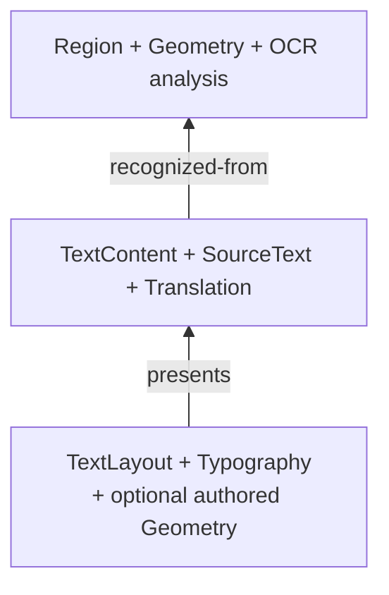

# シーンとストレージ

シーンとストレージは異なる種類の真実を所有します。

## シーンの意味

`koharu-scene` は正規のインメモリ文書です。プロジェクトには順序付きページがあり、各ページは安定した外部 Entity ID、階層、型付きコンポーネントと関係を持つローカルアリーナです。

文字解析、意味内容、表示は分離されています。

検出ジオメトリは移動可能な表示レイヤーになりません。OCR の由来を残したまま翻訳を変え、意味テキストを書き換えずに組版を変えられます。

## スナップショットとパッチ

スナップショットは不変で安価に複製できます。編集はプロジェクトと基準リビジョンに結びつくパッチを作り、各操作は前提条件とセッション undo 用の逆操作を記録します。

古いパッチを暗黙に受理しません。独立した派生処理は新しいスナップショットへ明示的に rebase し、観測入力または重複書込が変わっていれば失敗します。

## 永続形式

`koharu-storage` はドメイン非依存で、`state-a.khr` と `state-b.khr` の交互スロットへ完全な不透明シーン状態を保存し、コンテンツアドレス化した不変 blob、チェックサム、参照 blob 集合を管理します。

保存は不足 blob を先に公開し、無効側スロットを作成・flush して原子的に永続化します。失敗しても以前の有効スロットを残します。開始時は最新の有効状態を選び、新しい方が壊れていればもう一方へ戻れます。

ガベージコレクションは明示的で、両方の有効ディスク状態と undo 履歴を含む生存スコープの blob を保持します。

アプリは `.khrproj` の命名、現在ページ、履歴グループ、UI 投影を所有し、レンダラーやパイプラインはストレージファイルへ直接書きません。
