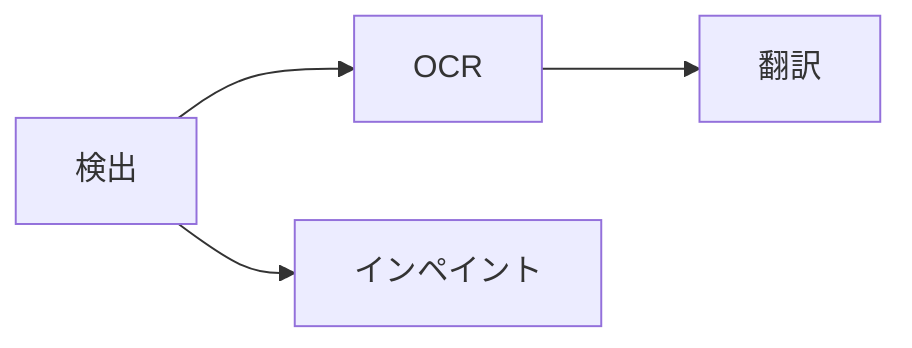

# ページを処理する

Koharu のワークフローは固定かつ明示的です。

検出は解析領域と除去マスクを作り、OCR は検出文字を読み、翻訳は対象言語の内容を書き、インペイントは原文文字下の画像を再構築します。

## 範囲を選ぶ

キャンバス上部の処理セレクターには次の範囲があります。

- **現在のページ** — キャンバスに表示中のページ
- **選択したページ** — ページレールで選択したページ
- **プロジェクト全体** — プロジェクト順の全ページ

**処理**メニューでは、選択テキスト要素だけに OCR と翻訳を実行することもできます。

## ステージを選ぶ

検出、OCR、翻訳、インペイントから空でない任意の組み合わせを選べます。全部を選ぶと完全なワークフロー、1 つならそのステージだけを実行します。複数の選択ステージは固定されたワークフロー順で実行されます。選択していない前提ステージは自動追加されないため、下流ステージに新しい入力が必要なら検出や OCR も選んでください。

一般的なステージ構成には、処理メニューの**検出/OCR/翻訳/インペイントまで実行**を使います。**インペイントまで実行**は検出とインペイントを実行し、OCR と翻訳は実行しません。

## 進捗と部分結果

同時に実行できる処理ジョブは 1 つです。アクティビティセンターにページ、ステージ、モデル、完了数、エラーが表示されます。

各ステージは完了直後に結果をコミットします。そのため、全ページの同一段階を待たずに表示が更新され、後段で失敗しても先に完了した結果は残ります。停止後は新しい処理を開始せず、実行中のネイティブ推論は安全な境界まで戻り、未コミットの結果は破棄されます。

入力がないステージは正常にスキップされます。たとえば文字を検出しなかったページは OCR と翻訳を必要としません。

派生ステージの再実行はその出力を置き換えます。部分修正ではページまたは要素の狭い範囲を選んでください。
