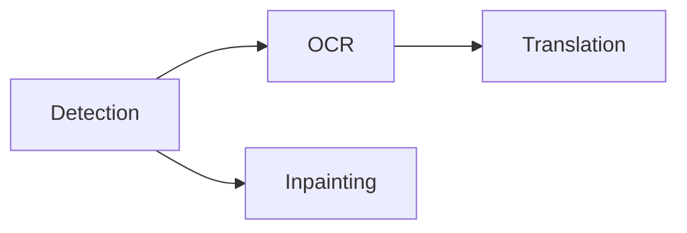

# Process Pages

Koharu uses a fixed, explicit workflow:

Detection creates analysis regions and removal masks. OCR reads detected text. Translation writes target-language content. Inpainting reconstructs artwork beneath the source lettering.

## Choose a scope

The processing selector above the canvas supports:

- **Current page** — only the page visible in the canvas;
- **Selected pages** — the pages selected in the page rail;
- **Entire project** — every page in project order.

The **Process** menu also offers selected-layer processing for OCR and translation. Use that after correcting or adding a small set of text elements.

## Choose stages

Select any non-empty subset of detection, OCR, translation, and inpainting. Selecting all stages runs the complete workflow. Selecting one stage runs only that stage. Multiple selected stages run in the fixed workflow order. Omitted prerequisites are not added automatically, so include detection or OCR when a downstream stage needs fresh input.

Use **Run through Detection/OCR/Translation/Inpainting** in the Process menu for common stage groups. **Run through Inpainting** means detection plus inpainting; it does not also run OCR and translation.

## Progress and partial results

Only one processing job runs at a time. The activity center reports the active page, stage, model, completed work, and failures.

Each stage commits its result as soon as it finishes. This means:

- completed pages update without waiting for a project-wide barrier;
- earlier commits remain if a later stage fails;
- stopping prevents new work from starting;
- native inference already in progress returns at a safe boundary, and its result is discarded if the stop was requested before commit.

A stage with no applicable input is skipped successfully. For example, a page with no detected text does not need OCR or translation.

## Rerun deliberately

Rerunning a derived stage replaces that stage's semantic output. Review authored corrections before rerunning detection or OCR over the same elements. Use a narrow page or element scope when only part of the project needs repair.
