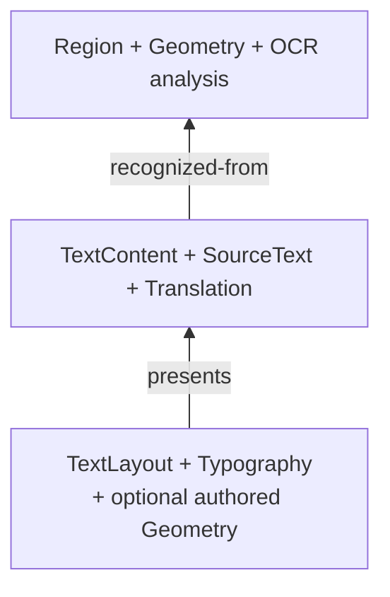

# 场景与存储

场景和存储有意拥有不同类型的事实。

## 场景语义

`koharu-scene` 拥有权威内存文档。项目包含有序页面，每页拥有稳定外部 Entity ID、层级、类型化组件和关系的本地 arena。

文字分析、语义内容和视觉呈现彼此分离：

检测几何因此始终是原稿分析，不会变成可移动可见图层。翻译变化不丢失 OCR 来源，排字变化也不必重写语义文本。

## 快照与补丁

快照不可变且复制成本低。编辑创建绑定项目和基础修订的补丁；每项操作记录前置条件和用于会话撤销的逆操作。

过时补丁不会被静默接受。独立派生任务必须显式 rebase 到新快照；观测输入或重叠写入发生变化时，rebase 失败。

## 存储格式

`koharu-storage` 与领域无关，保存：

- 在 `state-a.khr` 与 `state-b.khr` 之间交替发布的完整不透明场景状态
- 内容寻址不可变 blob
- 校验和与验证状态所需的引用 blob 集合

保存时先发布缺失 blob，再在目标旁构建非活动状态槽，flush 后原子持久化。发布失败不会破坏先前有效槽。打开时选择最新有效状态，新槽损坏时可回退到另一个有效槽。

垃圾回收是显式操作，会保留两个有效磁盘状态及所有活动场景作用域引用的 blob，包括会话撤销历史。

应用负责 `.khrproj` 命名、活动页面、撤销分组和 UI 投影。渲染器、流水线与智能体只消费快照并提交语义补丁，不直接写存储文件。
