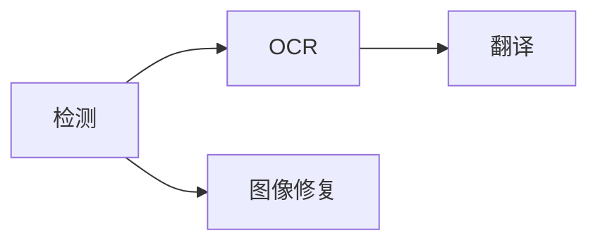

# 处理页面

Koharu 使用固定、明确的工作流：

检测生成分析区域和移除蒙版；OCR 读取检测文字；翻译写入目标语言内容；图像修复重建原文字样下方的画面。

## 选择范围

画布上方的处理选择器支持：

- **当前页面** — 画布正在显示的页面
- **所选页面** — 页面栏中选择的页面
- **整个项目** — 按项目顺序处理所有页面

**处理**菜单还可以只对所选文本元素执行 OCR 和翻译，适合修复少量内容。

## 选择阶段

可以选择检测、OCR、翻译、图像修复中的任意非空组合。全部选中会运行完整流程，只选一个则仅运行该阶段。多个已选阶段会按固定工作流顺序运行；未选择的前置阶段不会自动加入，因此当下游阶段需要新输入时，也应选择检测或 OCR。

常见阶段组合可使用处理菜单中的**运行至检测/OCR/翻译/图像修复**。**运行至图像修复**只运行检测和图像修复，不会同时运行 OCR 与翻译。

## 进度与部分结果

同一时间只能运行一个处理任务。活动中心显示当前页面、阶段、模型、完成数量与错误。

每个阶段完成后立即提交，因此页面无需等待全项目同一阶段结束即可更新；后续失败时先前提交仍保留；停止后不会开始新工作；正在执行的原生推理会返回安全边界，若尚未提交则丢弃结果。

没有适用输入的阶段会正常跳过。例如未检测到文字的页面不需要 OCR 与翻译。

重新运行派生阶段会替换该阶段输出。只需修复局部时，请使用较窄的页面或元素范围。
