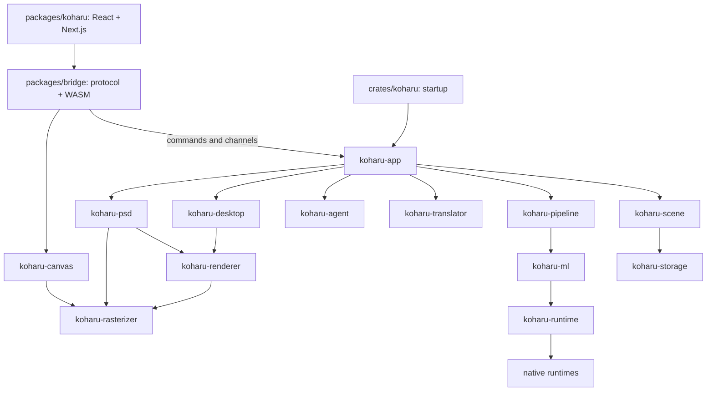

Koharu runs as a desktop application. React invokes typed Tauri commands; native components own durable project state and processing.

## Interface and application

| Component         | Responsibility                                                                                                     |
| ----------------- | ------------------------------------------------------------------------------------------------------------------ |
| `packages/koharu` | Project browser, page rail, canvas controls, inspector, settings, activity, Agent, and transient interaction state |
| `packages/ui`     | Shared React primitives and styling                                                                                |
| `packages/bridge` | Generated Tauri protocol, browser canvas adapter, and derived WASM package                                         |
| `crates/koharu`   | Startup, diagnostics, Tauri configuration, and build integration                                                   |
| `koharu-app`      | Tauri state, project lifecycle, command serialization, jobs, synchronization, and Agent hosting                    |

Independent typed channels carry project, canvas, job, download, and resource updates; Agent sign-in and runs stream through per-call channels. Preferences are fetched and saved through commands. The frontend does not use an HTTP client or a generic application event envelope.

<Note>
  Rust signatures generate `packages/bridge/src/protocol.ts`. Change the Rust source and [regenerate
  bindings](/en/development/setup#regenerate-ipc-bindings).
</Note>

## Scene and processing

`koharu-scene` owns the canonical project, hierarchy, components, relations, patches, revisions, and session undo. `koharu-storage` persists opaque complete state payloads and immutable blobs.

`koharu-pipeline` owns page-stage scheduling, model lifetime, progress, cancellation, and incremental commits. `koharu-ml` owns models and the shared device abstraction; `koharu-translator` owns local and hosted translation connections.

## Rendering and transport

`koharu-renderer` interprets a page as a portable prepared frame owned by `koharu-rasterizer`. Browser transport splits its manifest from content-hashed resources. Raster data is tiled with sampling gutters, bounding browser copies, validation, uploads, and eviction.

`koharu-canvas` retains resources across pages and activates a staged frame through WebGPU only when every dependency is ready. Native PNG, PSD, font previews, and Agent previews compose the same full-resolution resources through native readback.

`koharu-desktop` coordinates latest-wins preparation and exact-generation manifests and resources. The webview owns the visible window surface.

## Native runtime boundary

Safe wrappers `koharu-torch`, `koharu-llama`, and `koharu-diffusion` are separate from unsafe `-sys` dynamic-loading crates. `koharu-runtime` discovers, downloads, validates, and loads their packages.

Three crates are shared across the diagram and omitted from it: `koharu-config` owns the typed sections of `config.toml`, `koharu-secrets` wraps the operating system credential store, and `koharu-metrics` collects telemetry.

<CardGroup cols={2}>
  <Card title="Scene and storage" icon="database" href="/en/development/scene">
    Trace edits, revisions, publication, and recovery.
  </Card>

  <Card title="Processing and rendering" icon="layer-group" href="/en/development/rendering">
    Follow stage commits through browser presentation.
  </Card>
</CardGroup>
