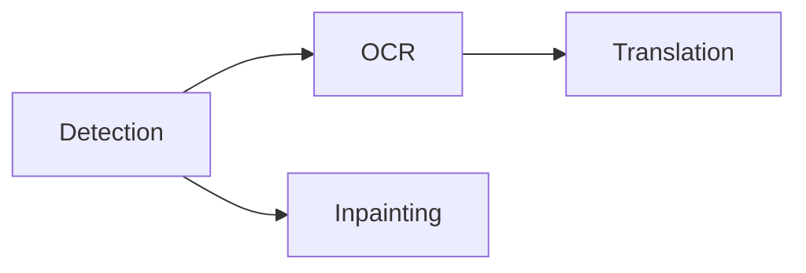

## Schedule the fixed pipeline

`koharu-pipeline` schedules one stage on one page as its execution unit:

Pages enter in project order. Completed detection makes that page's dependent branches eligible immediately, without waiting for detection on the whole project. At most one job per stage runs at a time, and the number of pages in flight is bounded by the number of selected stages.

Stages return semantic patches. The application commits each result, synchronizes the canvas, and records each commit as its own undo step.

## Manage residency and stopping

Accelerator inference uses one admission lane: representative heterogeneous overlap reduced throughput through compute and memory-bandwidth contention. The translation stage takes the lane for every provider, including remote APIs. CPU-only work can keep independent per-model lanes.

Models load lazily and remain reusable. When a stage fails with an out-of-memory error, the runner releases the accelerator lane, unloads the other stages' models, waits briefly for a fresh resource sample, and retries once. Any other failure unloads the failing stage's model. A settings change rebuilds the stage runner, so models reload on the next run.

Stopping is cooperative. New stages do not start after a stop request. Active native inference returns safely; an uncommitted result is discarded.

## Prepare a retained frame

`koharu-renderer::Renderer` turns a scene snapshot and page ID into an immutable `Frame` with ordered layers, entity lookup, presentation metadata, dependencies, diagnostics, and vector scenes. It prepares a portable `koharu-rasterizer` bundle for browser display and native readback.

Translation is the only visible text source. Typography, fit relations, fonts, images, visibility, and opacity come from the scene. Callers do not supply a second document model.

<Note>
  WebGPU presentation, PNG, layer crops, and PSD consume the same prepared frame. Incremental reuse
  must produce the same result as a full render.
</Note>

## Present in the browser

The Tauri CEF webview owns the visible surface. React draws the interface; `koharu-canvas` compiles to WASM and renders to an `HTMLCanvasElement` with WebGPU. Camera motion, transform previews, strokes, and sampling stay transient in the browser. Completed edits cross Tauri commands.

<Steps>
  <Step title='Publish a generation'>
    A page change announces a generation before its lightweight manifest is requested.
  </Step>
  <Step title='Fetch missing resources'>
    The canvas reports missing content IDs and receives resource packets asynchronously.
  </Step>
  <Step title='Activate the complete frame'>
    The previous page remains visible until the staged generation is ready. Obsolete preparation or
    requests cannot replace a newer generation.
  </Step>
</Steps>

Raster resources use 1024-pixel logical tiles with one-pixel interior sampling gutters. These bound WASM copies and GPU textures while preserving filtered edges. Coordinated CPU/GPU caches avoid resending or uploading unchanged resources when revisiting pages.

## Inspect the desktop result

Validate visual changes in the final Tauri window: adapter availability, device loss, sizing, and display scaling depend on the webview. Native PNG and PSD checks cover the shared readback path.

Debug builds expose CEF at `http://127.0.0.1:4000`. Use semantic CDP inspection for DOM and canvas lifecycle, and native window capture for final pixels.
