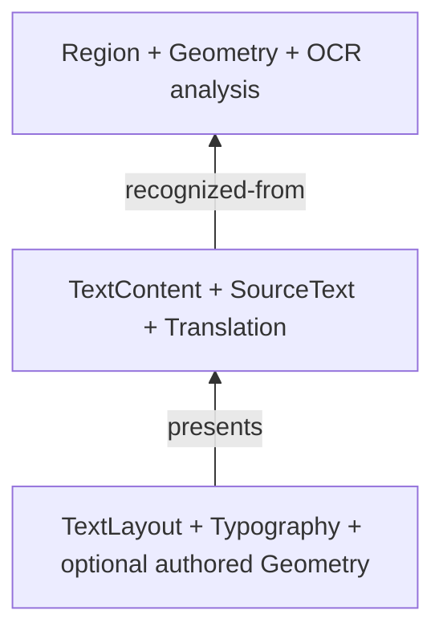

`koharu-scene` owns what a project means. `koharu-storage` owns how complete states and immutable bytes become durable.

## Separate analysis, content, and presentation

Projects contain ordered pages. Each page has stable external entity IDs, a local arena, hierarchy, typed components, and relations.

Detection geometry stays analysis rather than becoming a movable visible layer. Translation can change without losing OCR provenance; typography can change without rewriting semantic text.

## Apply an edit

Snapshots are immutable and cheap to clone. A patch binds to a project and base revision, records operation preconditions, and carries inverses for session undo.

<Note>
  A stale patch is not accepted silently. Derived work must explicitly rebase, and rebasing fails
  when anything the patch observed has changed since its base revision.
</Note>

## Publish a state

Storage is domain-agnostic. It saves an opaque complete scene payload into alternating `state-a.khr` and `state-b.khr` slots, with immutable content-addressed blobs, checksums, and a referenced-blob set.

<Steps>
  <Step title='Publish missing blobs'>
    Make referenced bytes available before publishing the state that needs them.
  </Step>
  <Step title='Write the inactive state'>
    Build the new slot beside its destination and flush it.
  </Step>
  <Step title='Publish atomically'>
    Make the new slot durable while retaining the previously valid slot if publication fails.
  </Step>
</Steps>

## Recover and collect

Opening selects the newest valid state and can fall back to the other slot if the newer one is corrupt. Blob reads may use read-only memory mapping without exposing that detail to scene consumers.

Storage and scene expose a garbage-collection routine that preserves blobs referenced by both valid disk states and live scene scopes, including undo history. The application does not call it yet, so unreferenced blobs remain on disk.

## Keep application ownership separate

The application owns `.khrproj` directories, names, active-page selection, undo grouping, and UI projection. Renderer, pipeline, and Agent consume snapshots and submit semantic patches; they do not write storage files directly.
