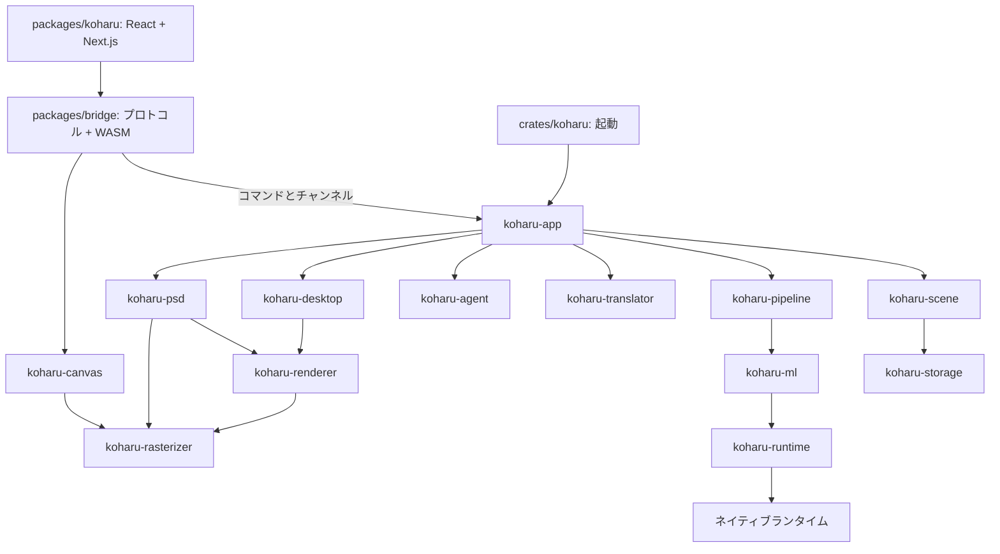

Koharu はデスクトップアプリです。React が型付き Tauri コマンドを呼び、ネイティブ側が永続プロジェクト状態と処理を担当します。

## UI とアプリケーション

| コンポーネント    | 責務                                                                                                        |
| ----------------- | ----------------------------------------------------------------------------------------------------------- |
| `packages/koharu` | プロジェクト一覧、ページ一覧、キャンバス操作、インスペクター、設定、アクティビティ、Agent、一時的な操作状態 |
| `packages/ui`     | 共通 React 部品とスタイル                                                                                   |
| `packages/bridge` | 生成 Tauri プロトコル、ブラウザーキャンバスアダプター、派生 WASM パッケージ                                 |
| `crates/koharu`   | 起動、診断、Tauri 設定、ビルド統合                                                                          |
| `koharu-app`      | Tauri 状態、プロジェクトのライフサイクル、コマンド直列化、ジョブ、同期、Agent ホスト                        |

独立した型付きチャンネルがプロジェクト、キャンバス、ジョブ、ダウンロード、リソースの更新を運びます。Agent のサインインと実行は呼び出しごとのチャンネルでストリーミングします。設定はコマンドで取得・保存します。UI は HTTP クライアントや汎用アプリイベントの封筒を使いません。

<Note>
  `packages/bridge/src/protocol.ts` は Rust 署名から生成します。Rust
  を変更して[バインディングを再生成](/ja/development/setup)してください。
</Note>

## シーンと処理

`koharu-scene` は正規プロジェクト、階層、コンポーネント、関係、パッチ、リビジョン、セッション undo を所有します。`koharu-storage` は不透明な完全状態と不変 blob を永続化します。

`koharu-pipeline` はページ・段階のスケジューリング、モデル寿命、進捗、停止、逐次コミットを担当します。`koharu-ml` はモデルと共通デバイス抽象、`koharu-translator` はローカル・ホスト型の翻訳接続を担当します。

## 描画と転送

`koharu-renderer` はページを `koharu-rasterizer` 所有の移植可能な準備済みフレームへ変換します。ブラウザー転送ではマニフェストと内容ハッシュ付きリソースを分けます。ラスターはサンプリング用の余白付きタイルに分割し、コピー、検証、アップロード、解放の単位を制限します。

`koharu-canvas` はページ間でリソースを保持し、依存がそろった段階で WebGPU のフレームを切り替えます。ネイティブ PNG、PSD、フォントと Agent のプレビューも、同じフル解像度リソースをネイティブ読み戻しで合成します。

`koharu-desktop` は最新要求を優先した準備と、厳密な世代のマニフェスト・リソースを管理します。表示ウィンドウの表面は WebView が所有します。

## ネイティブランタイム

安全な `koharu-torch`、`koharu-llama`、`koharu-diffusion` は unsafe な `-sys` 動的ロード crate から分離します。`koharu-runtime` がパッケージの検出、取得、検証、ロードを担当します。

図には載せていない共通の crate が 3 つあります。`koharu-config` は `config.toml` の型付きセクションを所有し、`koharu-secrets` は OS の資格情報ストアをラップし、`koharu-metrics` はテレメトリーを収集します。

<CardGroup cols={2}>
  <Card title="シーンと保存" icon="database" href="/ja/development/scene">
    編集、リビジョン、公開、復旧の流れを確認します。
  </Card>

  <Card title="処理と描画" icon="layer-group" href="/ja/development/rendering">
    段階のコミットからブラウザー表示までを追います。
  </Card>
</CardGroup>
