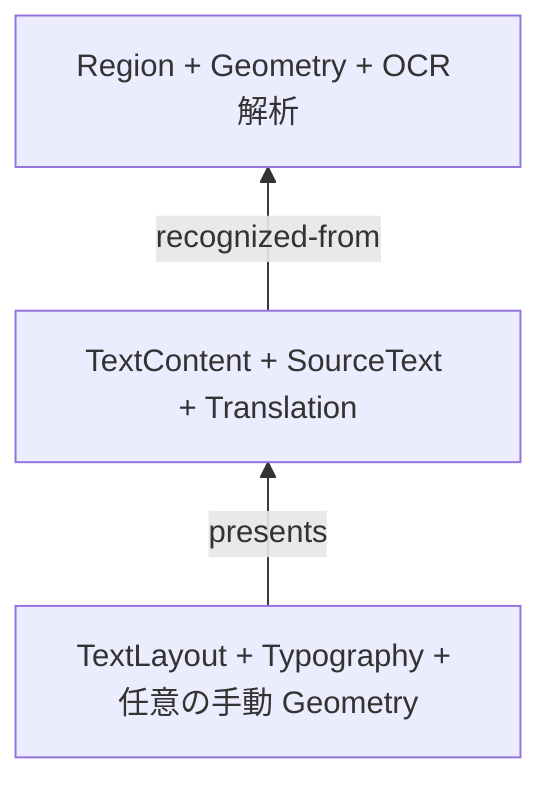

`koharu-scene` がプロジェクトの意味を、`koharu-storage` が完全状態と不変データの永続化を担当します。

## 解析・内容・表示を分ける

プロジェクトは順序付きページを持ちます。各ページには安定した外部エンティティ ID、ローカル arena、階層、型付きコンポーネントと関係があります。

検出形状は解析のままで、移動可能な表示レイヤーにはなりません。OCR の来歴を保って翻訳を変え、意味テキストを書き換えずに組版を変更できます。

## 編集を適用する

スナップショットは不変で、安価に複製できます。パッチはプロジェクトと基準リビジョンに結びつき、操作の前提条件と undo 用の逆操作を記録します。

<Note>
  古いパッチを暗黙に受け入れません。派生処理は明示的に rebase
  し、パッチが参照したものが基準リビジョン以降に変わっていれば失敗します。
</Note>

## 状態を公開する

ストレージはドメインを解釈しません。完全なシーンを不透明なペイロードとして `state-a.khr` と `state-b.khr` に交互に保存し、不変の内容アドレス blob、チェックサム、参照 blob 集合で検証します。

<Steps>
  <Step title='不足する blob を公開する'>
    それを参照する状態を公開する前に、必要なデータを保存します。
  </Step>
  <Step title='非アクティブ側を書き込む'>
    出力先の隣で新しいスロットを構築し、フラッシュします。
  </Step>
  <Step title='アトミックに公開する'>
    新しいスロットを永続化します。公開に失敗しても以前の有効なスロットが残ります。
  </Step>
</Steps>

## 復旧と回収

開くときは最新の有効状態を選び、新しい側が破損していれば他方に戻れます。blob は読み取り専用メモリマップを使えますが、シーンの利用者へその詳細を公開しません。

ストレージとシーンはガベージコレクション処理を公開しており、両方の有効なディスク状態と、undo 履歴を含む生存中のシーンスコープが参照する blob を保持します。アプリはまだこれを呼び出さないため、参照されない blob はディスクに残ります。

## アプリケーションの担当範囲

アプリは `.khrproj`、名前、現在ページ、undo グループ、UI 投影を担当します。レンダラー、パイプライン、Agent はスナップショットを読み意味パッチを提出し、保存ファイルへ直接書き込みません。
