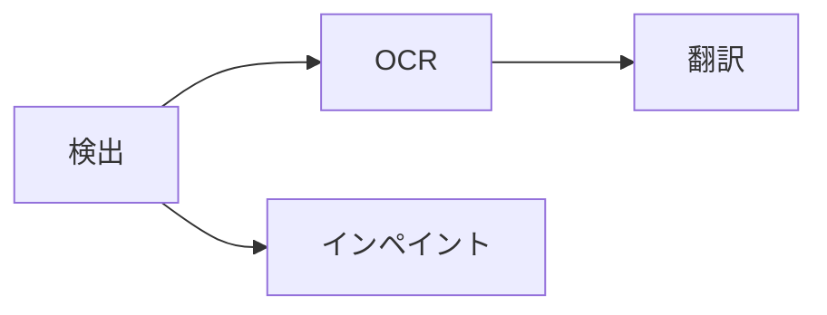

キャンバス上部の処理セレクターで対象ページと段階を選びます。作業に必要な最小範囲から始めてください。

## 対象を選ぶ

<Tabs>
  <Tab title='現在のページ'>キャンバスに表示しているページだけを処理します。</Tab>
  <Tab title='選択したページ'>ページ一覧で選択したページを処理します。</Tab>
  <Tab title='プロジェクト全体'>プロジェクト順にすべてのページを処理します。</Tab>
  <Tab title='選択したレイヤー'>
    少数のテキストを修正・追加した後は、**処理 →
    選択したレイヤーを処理**を選びます。選択したレイヤーだけに OCR と翻訳を実行します。
  </Tab>
</Tabs>

## 段階を選ぶ

1 つ以上の段階を選び、**実行**します。選択した段階は次の依存順に進みます。

検出が領域と除去マスクを作り、OCR が領域を読み、翻訳が訳文を書き込み、インペイントが文字の下の画像を修復します。

<Note>
  省略した前提段階は自動追加されません。新しい入力が必要なら検出や OCR
  も選びます。**インペイントを実行**は検出とインペイントだけで、OCR と翻訳は含みません。
</Note>

**処理**メニューには**プロジェクトを処理**、**選択ページを処理**のほか、**検出を実行**、**OCRを実行**、**翻訳を実行**、**インペイントを実行**もあります。**実行**の項目は指定した段階までのすべての段階を実行し、対象セレクターの設定にかかわらず常にプロジェクト全体が対象です。

## 進捗と停止

処理ジョブは同時に 1 つだけで、実行中はページを読み込めません。アクティビティセンターで段階、モデル、進捗、失敗を確認します。

各段階は完了時に結果をコミットします。後続段階が失敗しても完了済みの結果は残ります。停止すると新しい作業は始まらず、実行中のネイティブ呼び出しは安全な境界で戻ります。コミット前に停止要求があれば、その結果は破棄されます。

入力がない段階は推論せずに完了しますが、モデルのロードは先に行われます。文字が検出されなかったページに OCR や翻訳は不要です。

<Warning>
  段階を再実行しても手動の編集は失われません。検出は文字領域がすでにあるページをスキップするため、再検出するには既存の領域を削除します。OCR
  と翻訳は生成されたテキストを置き換えますが、手動で編集した原文と訳文は残します。インペイントは、新しい**除去**マスクを描かない限り、クリーンアップレイヤーがすでにあるページをスキップします。
</Warning>

続いて[テキストの確認](/ja/guides/review)や[画像修復](/ja/guides/cleanup)を行います。
