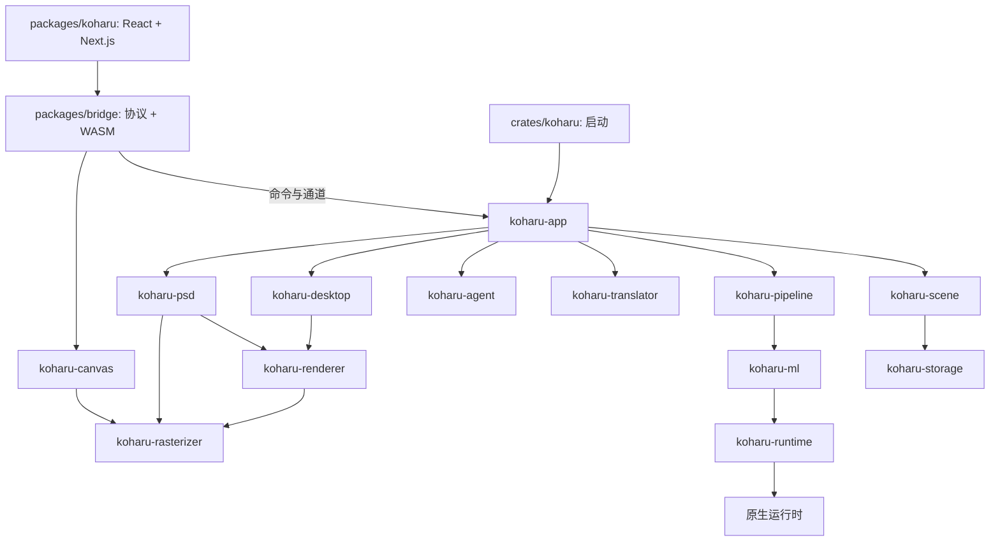

Koharu 是桌面应用。React 调用类型化 Tauri 命令，原生组件负责持久项目状态和处理任务。

## 界面与应用

| 组件              | 职责                                                                     |
| ----------------- | ------------------------------------------------------------------------ |
| `packages/koharu` | 项目列表、页面栏、画布控制、检查器、设置、活动中心、Agent 和瞬时交互状态 |
| `packages/ui`     | 共享 React 基础组件与样式                                                |
| `packages/bridge` | 生成的 Tauri 协议、浏览器画布适配器和派生 WASM 包                        |
| `crates/koharu`   | 启动、诊断、Tauri 配置和构建集成                                         |
| `koharu-app`      | Tauri 状态、项目生命周期、命令串行化、任务、同步和 Agent 宿主            |

独立类型化通道传递项目、画布、任务、下载与资源更新；Agent 登录和运行通过按调用创建的通道流式传输。偏好设置通过命令读取和保存。前端不使用 HTTP 客户端或通用应用事件信封。

<Note>
  `packages/bridge/src/protocol.ts` 由 Rust 签名生成。修改 Rust
  后[重新生成绑定](/zh/development/setup)。
</Note>

## 场景与处理

`koharu-scene` 拥有权威项目、层级、组件、关系、补丁、修订和会话撤销。`koharu-storage` 持久化不透明的完整状态与不可变 blob。

`koharu-pipeline` 负责页面阶段调度、模型生命周期、进度、取消和增量提交。`koharu-ml` 拥有模型与共享设备抽象；`koharu-translator` 负责本地和托管翻译连接。

## 渲染与传输

`koharu-renderer` 将页面解释成由 `koharu-rasterizer` 所有的可移植预备帧。浏览器传输将清单与内容哈希资源分离。栅格数据分为带采样边缘的瓦片，使复制、验证、上传和驱逐都具有有界粒度。

`koharu-canvas` 跨页面保留资源，只在依赖齐备后通过 WebGPU 激活暂存帧。原生 PNG、PSD、字体预览和 Agent 预览通过原生回读合成相同的全分辨率资源。

`koharu-desktop` 协调最新请求优先的准备工作，提供精确代次的清单和资源。可见窗口表面由 WebView 拥有。

## 原生运行时边界

安全包装层 `koharu-torch`、`koharu-llama`、`koharu-diffusion` 与 unsafe `-sys` 动态加载 crate 分离。`koharu-runtime` 负责发现、下载、验证和加载软件包。

有三个 crate 被图中各组件共用，因此未在图中标出：`koharu-config` 拥有 `config.toml` 的类型化配置节，`koharu-secrets` 封装操作系统凭据存储，`koharu-metrics` 收集遥测数据。

<CardGroup cols={2}>
  <Card title="场景与存储" icon="database" href="/zh/development/scene">
    了解编辑、修订、发布与恢复。
  </Card>

  <Card title="处理与渲染" icon="layer-group" href="/zh/development/rendering">
    追踪阶段提交到浏览器呈现。
  </Card>
</CardGroup>
