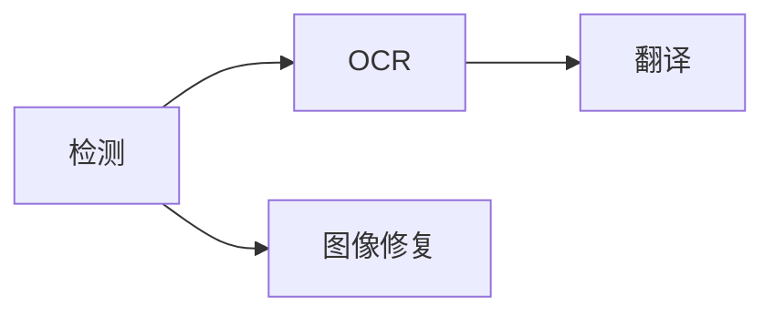

## 调度固定流水线

`koharu-pipeline` 以一页的一个阶段为执行单元：

页面按项目顺序进入。某页检测完成后，其依赖分支立即可运行，不等待整项目检测完毕。每个阶段同一时间最多运行一个任务，同时处理中的页面数以所选阶段数为上限。

阶段返回语义补丁，应用逐个提交结果、同步画布，并把每次提交记录为独立的撤销步骤。

## 驻留与停止

加速器推理采用单准入通道，因为代表性异构推理重叠会争用计算与内存带宽，降低吞吐。翻译阶段无论使用哪个服务商（包括远程 API）都会占用该通道。纯 CPU 执行可保持各模型独立通道。

模型按需加载并保留复用。某阶段因内存不足失败时，运行器会释放加速器通道、卸载其他阶段的模型、短暂等待新的资源采样，然后重试一次。其他失败会卸载出错阶段的模型。设置更改会重建阶段运行器，因此模型会在下次运行时重新加载。

停止是协作式的：请求后不启动新阶段，活动原生推理安全返回，未提交结果被丢弃。

## 准备保留帧

`koharu-renderer::Renderer` 从场景快照和页面 ID 创建不可变 `Frame`，包含有序图层、实体查找、呈现元数据、依赖、诊断和矢量场景，并准备供浏览器显示与原生回读使用的 `koharu-rasterizer` 资源包。

译文是唯一可见文字来源。排字、适配关系、字体、图片、可见性和不透明度来自场景；调用方不提供第二套文档模型。

<Note>WebGPU、PNG、图层裁切和 PSD 消费相同预备帧。增量复用必须与完整渲染产生相同结果。</Note>

## 浏览器呈现

Tauri CEF WebView 拥有可见表面。React 绘制界面，编译为 WASM 的 `koharu-canvas` 通过 WebGPU 在 `HTMLCanvasElement` 上呈现。相机、变换预览、笔画和取色留在浏览器瞬时状态中，只有完成的编辑跨越 Tauri 命令边界。

<Steps>
  <Step title='发布代次'>切页先发布代次，再请求轻量清单。</Step>
  <Step title='获取缺失资源'>画布报告缺少的内容 ID，异步接收资源包。</Step>
  <Step title='激活完整帧'>新代次准备完前保留旧页面。过期准备或请求不能覆盖更新代次。</Step>
</Steps>

栅格资源使用逻辑 1024 像素瓦片和内部边缘的一像素采样余量，在保留过滤边缘的同时限制 WASM 复制与 GPU 纹理大小。协调的 CPU/GPU 缓存避免回访页面时重传和重复上传未变化资源。

## 检查最终桌面结果

适配器可用性、设备丢失、尺寸和显示缩放依赖 WebView，因此视觉改动要在最终 Tauri 窗口中检查。原生 PNG 和 PSD 检查覆盖共享回读路径。

debug 构建在 `http://127.0.0.1:4000` 暴露 CEF 调试端点。DOM 和画布生命周期使用语义 CDP 检查；最终像素使用原生窗口捕获。
