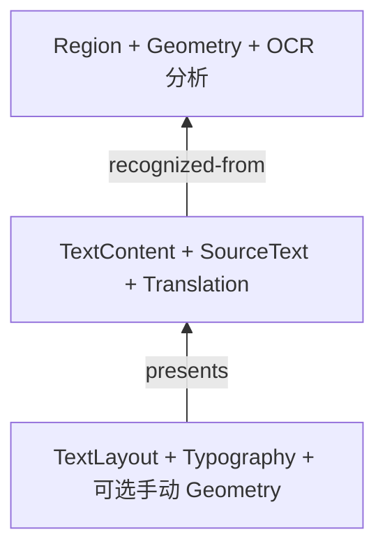

`koharu-scene` 负责项目含义，`koharu-storage` 负责完整状态与不可变字节如何可靠落盘。

## 分离分析、内容和呈现

项目包含有序页面。每页具有稳定外部实体 ID、本地 arena、层级、类型化组件与关系。

检测几何仍属于分析，不会变成可移动的可见图层。修改译文不丢失 OCR 来源，调整排字不必改写语义文本。

## 应用编辑

快照不可变且复制成本低。补丁绑定项目和基础修订，记录操作前置条件，并携带会话撤销所需的逆操作。

<Note>
  过期补丁不会被静默接受。派生工作必须显式
  rebase；补丁观察到的任何内容自其基础修订以来发生变化时，rebase 会失败。
</Note>

## 发布状态

存储不解释领域内容。完整场景以不透明载荷交替写入 `state-a.khr` 和 `state-b.khr`，同时保存不可变内容寻址 blob、校验和及引用 blob 集合。

<Steps>
  <Step title='发布缺少的 blob'>先保存被引用的字节，再发布需要它们的状态。</Step>
  <Step title='写入非活动槽'>在目标位置旁构建新槽并刷盘。</Step>
  <Step title='原子发布'>使新状态持久可见；发布失败时仍保留之前的有效槽。</Step>
</Steps>

## 恢复与回收

打开时选择最新有效状态；较新槽损坏时可以回退到另一槽。blob 读取可使用只读内存映射，但不向场景使用方暴露此存储细节。

存储与场景提供垃圾回收例程，保留两个有效磁盘状态以及包括撤销历史在内的活动场景作用域所引用的 blob。应用目前尚未调用它，因此未被引用的 blob 仍会留在磁盘上。

## 应用职责

应用负责 `.khrproj` 目录、命名、活动页面、撤销分组和 UI 投影。渲染器、流水线与 Agent 读取快照并提交语义补丁，不直接写存储文件。
